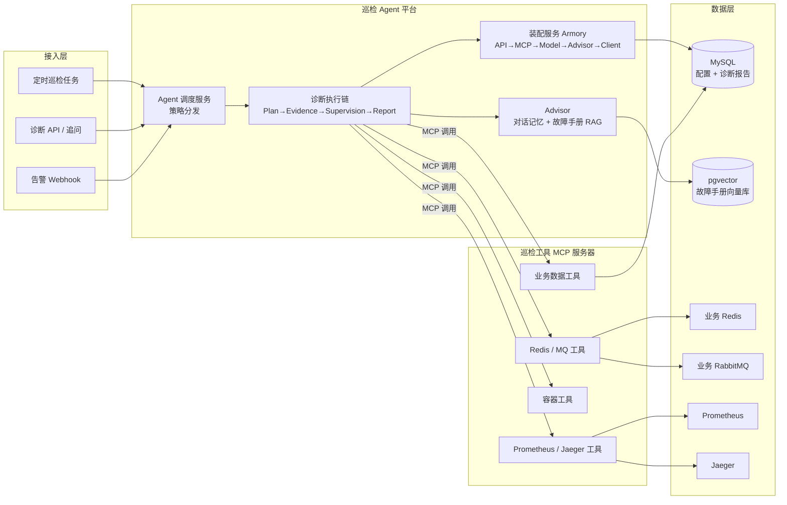

# Fault Patrol Agent — 业务系统智能故障巡检 Agent

面向业务系统故障定位场景的智能巡检 Agent 平台。通过组件化配置实现 Agent 灵活装配，基于 MCP 协议统一封装多个巡检工具，采用「规划-执行-监督-总结」多阶段协作与 RAG 知识库增强，自动完成故障取证、根因分析与处置建议输出，形成从告警发现、工具调用到诊断报告生成的完整故障排查链路。

## 技术栈

| 分类 | 技术 |
|------|------|
| 基础框架 | Spring Boot 3.4、Java 17、DDD 分层架构 |
| 数据存储 | MySQL（配置/报告）、Redis（巡检对象）、PostgreSQL + pgvector（向量知识库） |
| 中间件 | RabbitMQ（巡检对象）、Prometheus（指标）、Jaeger（链路） |
| AI 能力 | Spring AI 1.0（ChatClient / PgVectorStore / Advisor）、任意 OpenAI 兼容模型 |
| 工具协议 | MCP（Model Context Protocol），SSE / stdio 双传输 |
| 交互方式 | SSE 流式输出（四阶段过程实时回流） |

## 核心特性

### 1. 多阶段协作与流式交互
基于 Plan-and-Execute 模式将故障排查拆分为四个阶段，通过责任链驱动阶段流转：

```
故障分析规划 (Plan) ──▶ 多工具取证执行 (Evidence) ──▶ 证据质量监督 (Supervision) ──▶ 诊断报告 (Report)
        ▲                                                      │
        └──────────── FAIL / OPTIMIZE 回环重新取证 ◀─────────────┘
```

- 规划节点结合执行历史评估进度，制定取证策略（指标 / 链路 / 业务数据的组合）
- 取证节点调用绑定的 MCP 巡检工具完成多工具协同交叉取证
- 监督节点对证据做质量检查（PASS / FAIL / OPTIMIZE），不通过则改写任务回环重新取证，直至收敛或达到最大步数
- 全链路 SSE 流式输出：`plan` / `evidence` / `supervision` / `report` / `error` / `complete` 六类消息，报告阶段逐 token 打字机输出
- 支持会话级追问：同一 sessionId 复用多轮上下文

### 2. 多轮上下文与 RAG 增强
- 对话记忆 Advisor 维护多轮诊断上下文
- 故障手册（库存扣减、分布式锁、支付回调、MQ 积压、缓存一致性）经 Tika 解析 + TokenTextSplitter 切块向量化写入 PGVector，带 `knowledge` 标签
- `RagAnswerAdvisor` 在诊断阶段自动召回相关故障手册（标签过滤 + 相似度阈值），补充 Agent 上下文，降低故障知识遗漏

### 3. MCP 工具调用框架
独立部署的巡检工具 MCP 服务器（`fault-patrol-agent-mcp-server`），统一封装六类只读巡检工具：

| 工具 | 能力 |
|------|------|
| 业务数据 | 只读 SQL 查询（SELECT 限定 + 表白名单 + 行数上限） |
| Redis | 键扫描、键信息、内存、慢日志 |
| RabbitMQ | 概览、队列积压、连接、消费者 |
| 容器 | 容器列表、状态、日志、资源占用 |
| Prometheus | 瞬时/区间指标查询、活跃告警、采集目标 |
| Jaeger | 服务/操作列表、链路检索、单链路详情 |

- 全部工具只读设计，巡检过程对业务零影响
- 客户端按 MCP 配置统一超时控制；每个工具独立 enabled 开关，未启用/不可达时返回明确错误而不影响其他工具
- 工具与模型的绑定关系由数据库配置驱动，Agent 根据故障类型动态编排工具组合

### 4. 可观测链路整合
将「告警 → 指标 → 链路 → 业务数据」纳入统一取证维度：

- 告警 webhook 自动发起诊断任务（`POST /api/v1/inspect/alert`）
- 诊断过程交叉取证：Prometheus 指标确认异常水位 → Jaeger 链路定位异常节点 → 业务数据核对影响面 → 中间件检查佐证根因
- 输出含「故障概述 / 根因分析 / 处置建议 / 预防措施」的结构化诊断报告，落库可查询

### 5. 动态装配与扩展
基于责任链装配机制，将 API、Model、MCP Tool、Client 等组件模块化封装：

```
ai_client_api ─▶ ai_client_tool_mcp ─▶ ai_client_model ─▶ ai_client_advisor ─▶ ai_client
     (LLM 接口)      (MCP 连接)          (模型+工具回调)       (记忆/RAG)          (ChatClient)
```

全部组件由 MySQL 配置表驱动，运行时动态注册进 Spring 容器；修改配置 + 触发装配即可完成 Agent 能力调整，无需改代码。四阶段提示词同样存于配置表，可针对不同业务域定制巡检 Agent。

## 架构



## 模块说明

```
fault-patrol-agent
├── fault-patrol-agent-api               # 对外接口与 DTO
├── fault-patrol-agent-trigger           # HTTP 接入层：诊断/告警 SSE 接口、配置管理接口、定时巡检任务
├── fault-patrol-agent-domain            # 领域层：四阶段诊断执行链、装配服务、RAG 服务、任务服务
├── fault-patrol-agent-infrastructure    # 基础设施层：DAO / 仓储实现 / 持久化
├── fault-patrol-agent-types             # 基础组件：责任链框架、任务调度框架、公共枚举
├── fault-patrol-agent-app               # 启动装配：Spring Boot 应用、数据源、向量库 Bean
├── fault-patrol-agent-mcp-server        # 巡检工具 MCP 服务器（独立部署，端口 8092）
├── docs/sql                             # MySQL 初始化 SQL、pgvector 初始化 SQL
├── docs/fault-manuals                   # 故障手册（RAG 知识库源文件）
└── docker-compose.yml                   # 一键启动完整环境
```

## 快速开始

### 1. 一键启动（Docker）

```bash
docker compose up -d
```

启动后：

| 服务 | 地址 | 说明 |
|------|------|------|
| 主应用 | http://localhost:8091 | 巡检诊断 Agent 平台 |
| 巡检工具 MCP | http://localhost:8092/sse | MCP SSE 端点 |
| RabbitMQ 控制台 | http://localhost:15672 | guest / guest |
| Prometheus | http://localhost:9090 | 指标数据源 |
| Jaeger UI | http://localhost:16686 | 链路数据源 |

> 密钥通过 `.env` 文件注入（已 gitignore）：复制 `.env.example` 为 `.env` 并填入你自己的 `LLM_API_KEY` / `EMBEDDING_API_KEY` 后再启动。

### 2. 本地开发启动

依赖：MySQL 8、PostgreSQL（pgvector）、JDK 17、Maven 3.9。

```bash
# 1. 初始化数据库
mysql -uroot -p < docs/sql/fault-patrol-agent.sql
psql -U postgres < docs/sql/fault-patrol-agent-pgvector.sql

# 2. 配置密钥（application-dev.yml 或环境变量）
# LLM_BASE_URL / LLM_API_KEY / EMBEDDING_BASE_URL / EMBEDDING_API_KEY
# 本地开发时需将 MCP 工具地址改为本机：
# UPDATE ai_client_tool_mcp SET transport_config = '{"baseUri":"http://localhost:8092","sseEndpoint":"/sse"}' WHERE mcp_id = '9001';

# 3. 启动巡检工具 MCP 服务器（端口 8092）
mvn -pl fault-patrol-agent-mcp-server spring-boot:run

# 4. 启动主应用（端口 8091）
mvn -pl fault-patrol-agent-app spring-boot:run
```

### 3. 导入故障手册（RAG 知识库）

启动后将 `docs/fault-manuals` 下的故障手册入库（knowledge 标签固定为 `fault-handbook`）：

```bash
curl -X POST http://localhost:8091/api/v1/admin/ai-client-rag-order/file/upload \
  -F "name=故障手册-库存扣减" \
  -F "tag=fault-handbook" \
  -F "files=@docs/fault-manuals/01-库存扣减故障手册.md"
```

重复上述命令导入其余手册（分布式锁、支付回调、MQ 积压、缓存一致性）。

### 4. 发起一次故障诊断

```bash
curl -N -X POST http://localhost:8091/api/v1/inspect/diagnose \
  -H "Content-Type: application/json" \
  -H "Accept: text/event-stream" \
  -d '{
    "aiAgentId": "10001",
    "message": "订单服务下单接口错误率突增，疑似库存扣减异常，请定位根因并给出处置建议",
    "sessionId": "session_demo_001",
    "maxStep": 3
  }'
```

告警接入（webhook 自动发起诊断）：

```bash
curl -N -X POST http://localhost:8091/api/v1/inspect/alert \
  -H "Content-Type: application/json" \
  -H "Accept: text/event-stream" \
  -d '{
    "alertName": "订单服务错误率告警",
    "severity": "critical",
    "source": "prometheus",
    "alertContent": "order-service 5xx 错误率 5 分钟均值超过 10%"
  }'
```

### 5. 查询诊断报告

```bash
# 按会话查询
curl "http://localhost:8091/api/v1/inspect/reports?sessionId=session_demo_001"

# 按 ID 查询
curl "http://localhost:8091/api/v1/inspect/report/1"
```

## SSE 消息协议

诊断过程实时回流的 SSE 消息为 `data: {json}\n\n` 格式：

| type | 阶段 | subType（示例） |
|------|------|----------------|
| `plan` | 故障分析规划 | plan_status / plan_history / plan_strategy / plan_progress / plan_task_status |
| `evidence` | 多工具取证执行 | evidence_target / evidence_process / evidence_result / evidence_quality |
| `supervision` | 证据质量监督 | assessment / issues / suggestions / score / pass |
| `report` | 诊断报告 | 流式 delta 增量（delta=true 追加同一气泡） |
| `error` | 错误信息 | — |
| `complete` | 完成标识 | — |

## 配置说明

### 平台配置（application.yml / 环境变量）

```yaml
faultpatrol:
  security:
    enabled: true                 # 接口鉴权开关
    inspect-api-key: ""           # 巡检接口（/api/v1/inspect/**）API Key，请求头 X-Api-Key；为空不鉴权
    admin-api-key: ""             # 管理接口（/api/v1/admin/**）API Key；为空不鉴权
  llm:
    connect-timeout-ms: 30000     # LLM/Embedding 连接超时
    read-timeout-ms: 120000       # 读取超时
  alert:
    default-agent-id: 10001       # 告警默认巡检智能体
    webhook-secret: ""            # 告警签名密钥（HMAC-SHA256，X-Webhook-Signature）；为空不校验
    dedup-window-minutes: 30      # 告警指纹去重窗口（分钟）
spring:
  ai:
    retry:
      max-attempts: 2             # LLM 调用重试次数收敛
      backoff:
        initial-interval: 1000ms
        multiplier: 2
        max-interval: 5000ms
management:
  endpoints:
    web:
      exposure:
        include: health,info,metrics,prometheus   # /actuator/prometheus 平台自观测指标
```

### Agent 装配配置（MySQL）

四阶段 Agent 的能力完全由 `ai_agent` / `ai_agent_flow_config` / `ai_client*` 系列表驱动：

- `ai_client_api`：LLM 接口（任意 OpenAI 兼容服务，DeepSeek / 硅基流动 / vLLM 等）
- `ai_client_tool_mcp`：MCP 工具连接（SSE / stdio，超时秒级配置）
- `ai_client_model` + `ai_client_config`：模型与工具/顾问的绑定关系
- `ai_client_advisor`：对话记忆（ChatMemory）与故障手册召回（RagAnswer，`filterExpression` 按知识标签过滤）
- `ai_agent_flow_config.step_prompt`：四阶段提示词模板，可定制诊断口径

修改配置后调用 `POST /api/v1/inspect/armory_agent {"agentId": "10001"}` 重新装配生效。

### 巡检工具开关（fault-patrol-agent-mcp-server）

```yaml
faultpatrol:
  tools:
    redis:       { enabled: false, host: localhost, port: 6379 }
    rabbitmq:    { enabled: false, management-url: http://localhost:15672 }
    prometheus:  { enabled: false, base-url: http://localhost:9090 }
    jaeger:      { enabled: false, base-url: http://localhost:16686 }
    container:   { enabled: false, docker-cli: docker }
    business-data:
      enabled: false
      jdbc-url: jdbc:mysql://localhost:3306/fault_patrol_agent?...
      allowed-tables: [ orders, inventory ]   # 业务表白名单
      max-rows: 200
```

## 目录结构

```
fault-patrol-agent
├── fault-patrol-agent-api
│   └── src/main/java/cn/faultpatrol/api
│       ├── dto            # 诊断/告警/报告/配置 DTO
│       ├── response       # 统一响应包装
│       └── IInspectAgentService
├── fault-patrol-agent-trigger
│   └── src/main/java/cn/faultpatrol/trigger
│       ├── http/InspectAgentController   # 诊断/告警 SSE、报告查询、装配
│       ├── http/admin                    # 配置管理接口
│       └── job/InspectTaskJob            # 定时巡检任务
├── fault-patrol-agent-domain
│   └── src/main/java/cn/faultpatrol/domain/agent
│       ├── model                          # 实体与值对象
│       ├── service/execute/diagnose       # 四阶段诊断执行链（责任链）
│       │   └── step                       # Plan / Evidence / Supervision / Report 节点
│       ├── service/execute/flow           # 先规划后执行策略
│       ├── service/execute/fixed          # 固定链策略
│       ├── service/armory                 # 组件动态装配（含数据加载策略）
│       ├── service/rag                    # 故障手册向量化入库
│       └── service/dispatch               # 策略分发
├── fault-patrol-agent-infrastructure
│   └── src/main/java/cn/faultpatrol/infrastructure
│       ├── dao                            # MyBatis DAO + PO
│       └── adapter/repository             # 仓储实现
├── fault-patrol-agent-types
│   └── src/main/java/cn/faultpatrol/types
│       ├── design/framework/tree          # 责任链树框架
│       ├── job                            # 任务调度框架
│       └── common / enums / exception
├── fault-patrol-agent-mcp-server
│   └── src/main/java/cn/faultpatrol/mcpserver
│       ├── config                         # 工具装配与配置属性
│       └── tool                           # 六类只读巡检工具
└── docs
    ├── sql                                # 初始化 SQL
    ├── fault-manuals                      # 故障手册（RAG 源文件）
    └── observability/prometheus.yml       # Prometheus 配置示例
```

## 扩展指南

- **新增巡检工具**：在 `fault-patrol-agent-mcp-server` 增加 `@Tool` 方法并注册进 `InspectToolsConfig`，随后在 `ai_client_tool_mcp` 增加配置即可被 Agent 调用
- **新增诊断场景 Agent**：复制 `ai_agent_flow_config` 四阶段配置，替换 `step_prompt` 与知识标签，即可定制不同业务域的巡检 Agent
- **新增知识库**：编写故障手册后调用 RAG 上传接口，`knowledge` 标签与 Advisor `filterExpression` 对应即可按域召回
- **多业务域隔离**：`ai_agent.knowledge_tag` 配置业务域知识标签，诊断时 Agent 只召回该标签下的故障手册
- **本地模型**：`ai_client_model.model_type=ollama` 时走 Ollama 本地模型（`ai_client_api.base_url` 填 Ollama 地址，无需 apiKey），适合离线环境

## 进阶能力

| 能力 | 说明 |
|------|------|
| 诊断取消 | `POST /api/v1/inspect/cancel?sessionId=xxx`；前端断开 SSE 时自动联动取消，各阶段节点在每轮开始前检查取消标记 |
| 告警去重 | 告警指纹（SHA-256）+ 去重窗口，重复告警返回合并通知不再重复诊断（`alert_dedup` 表） |
| 工具调用轨迹 | 每次取证的工具名/入参/结果/耗时结构化记录，落库 `diagnosis_report.tool_trace` |
| 知识库管理 | `DELETE /api/v1/admin/ai-client-rag-order/file/delete?tag=&fileName=` 按标签/文件删除向量与台账 |
| 历史报告 | `GET /api/v1/inspect/reports/recent` 最近 50 条报告；首页「历史诊断报告」面板可视化查看 |
| 自观测 | `/actuator/health`、`/actuator/prometheus`（faultpatrol.diagnosis.duration / count / active 指标） |
| 单元测试 | `mvn test`：32 个单元测试（责任链/分节解析/报告提取/签名指纹/SQL 守卫/鉴权过滤器）；DAO/策略集成测试标记 @Ignore 需真实环境手动运行 |

## 开源协议

[Apache License 2.0](LICENSE)
