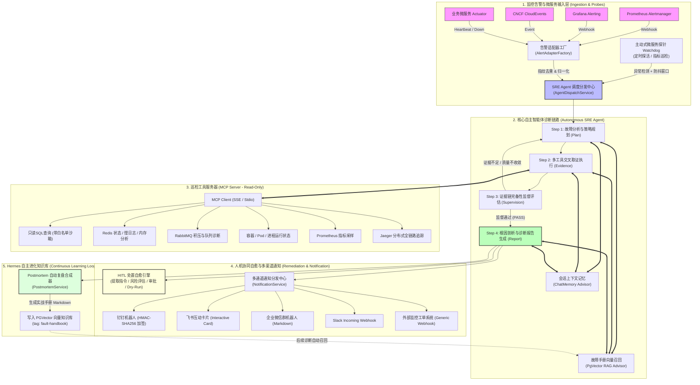

# Fault Patrol Agent — 企业级微服务智能故障巡检与自愈 Agent 平台

<p align="center">
  
  
  
  
  
  
</p>

---

## 📖 平台定位

**Fault Patrol Agent** 是一个面向现代云原生与微服务架构的**企业级自主 SRE 故障巡检、根因定位与自愈处置 Agent 平台**。

项目深度借鉴了顶尖开源 Agent 架构（如 **NousResearch/Hermes Agent** 的自主规划与自我演进闭环）以及 Google SRE 事故指挥体系，打破传统监控告警「收到报警 -> 人工排查 -> 查日志翻指标 -> 编写复盘」的繁琐被动流程，提供：
- **多源告警无缝接入**：原生兼容 Prometheus Alertmanager、Grafana Alerting、CNCF CloudEvents 与微服务 Actuator；
- **主动式微服务守望（Watchdog）**：微服务一键自注册、健康探针自适应心跳检测、防抖与静默窗口；
- **MCP 取证协议与四阶段自主规划（Plan-and-Execute）**：规划（Plan）➔ 取证（Evidence）➔ 监督（Supervision）➔ 总结（Report）；
- **人机协同（HITL）处置自愈引擎**：结构化提炼运维动作、风险分级、Dry-Run 预演沙箱与人机审批流；
- **多通道通知矩阵**：钉钉（加签）、飞书（交互卡片）、企业微信、Slack、通用 Webhook 实时送达；
- **Hermes 式故障经验自学习**：诊断完毕自动生成标准化故障实战复盘手册（Postmortem Playbook），并向量化归档至 RAG 知识库，实现「**越巡越聪明，遇难自演进**」。

---

## 🏛️ 系统总体架构



---

## 🌟 核心特性总览

| 能力维度 | 传统运维监控 / 自动化脚本 | Fault Patrol Agent |
|:---|:---|:---|
| **接入模式** | 紧耦合、专用脚本、各系统格式不一 | **统一适配器**：Alertmanager、Grafana、CloudEvents、Actuator 一键适配 |
| **排查方式** | 人工登录服务器、逐个翻查指标与日志 | **Plan-and-Execute 自主决策**：智能编排取证路径，自主假设-验证-收敛 |
| **工具协议** | 私有 SDK、代码入侵大 | **MCP（Model Context Protocol）标准协议**：即插即用、只读安全沙箱 |
| **处置决策** | 人工编写脚本，极易发生敲错命令风险 | **HITL 审批工作流**：风险等级自动定级、Dry-Run 预演演练、审批留痕 |
| **告警通知** | 机械简单的纯文本报警短信或群消息 | **富交互多通道矩阵**：钉钉加签、飞书互动卡片、企业微信、Slack 实时流送 |
| **知识沉淀** | 人工撰写复盘文档，往往沦为形式 | **Hermes 自主学习闭环**：结案自动提炼标准手册并写入 RAG，下次自动召回 |

---

## 🚀 快速开始

### 环境依赖
- **JDK**: 17+ (推荐 Eclipse Temurin / Azul Zulu 17)
- **构建工具**: Maven 3.8+
- **存储依赖**: MySQL 8.0+、PostgreSQL 14+（安装 `pgvector` 扩展）、Redis 6+（可选）
- **AI 模型**: 任意 OpenAI 兼容 API 规范（如 DeepSeek V3/R1、Qwen、vLLM、Ollama 本地部署等）

### 1. 数据库初始化

```bash
# 1. 导入 MySQL 元数据表结构（包含 Agent 装配、处置表、微服务目标表、通知渠道表等）
mysql -u root -p < docs/sql/fault-patrol-agent.sql

# 2. 初始化 PostgreSQL pgvector 向量知识库
psql -U postgres -d postgres < docs/sql/fault-patrol-agent-pgvector.sql
```

### 2. 配置文件说明 (`application-dev.yml`)

```yaml
spring:
  ai:
    openai:
      base-url: https://api.deepseek.com/v1   # 或其它 OpenAI 兼容网关
      api-key: sk-your-llm-api-key
    vectorstore:
      pgvector:
        host: localhost
        port: 5432
        database: postgres
        username: postgres
        password: password

faultpatrol:
  security:
    enabled: true
    inspect-api-key: "patrol-secret-key-12345" # 巡检接口鉴权 Key
    admin-api-key: "admin-secret-key-12345"     # 管理控制台鉴权 Key
  alert:
    webhook-secret: "my-webhook-hmac-secret"   # 告警验签秘钥
    dedup-window-minutes: 30                    # 告警指纹去重窗口
```

### 3. 一键编译与测试

```bash
# 验证编译与全量单元测试（包含 50+ 单元测试用例）
mvn clean test
```

### 4. 启动服务

```bash
# 终端 1：启动只读巡检 MCP 工具服务器 (默认端口 8092)
mvn -pl fault-patrol-agent-mcp-server spring-boot:run

# 终端 2：启动主巡检控制平面 (默认端口 8091)
mvn -pl fault-patrol-agent-app spring-boot:run
```

---

## 🔌 外部微服务系统无缝对接指南

Fault Patrol Agent 设计初衷就是作为独立微服务组件，赋能企业内部其它微服务（如电商订单中心、支付网关、仓储物流系统等）。

### 方式一：微服务一键自注册与主动守望 (Watchdog)

任何 Spring Boot 微服务在启动时，只需通过 HTTP 调用注册接口即可被巡检平台纳入主动探活范围：

```bash
curl -X POST http://localhost:8091/api/v1/inspect/patrol/microservice/register \
  -H "Content-Type: application/json" \
  -H "X-Api-Key: patrol-secret-key-12345" \
  -d '{
    "serviceName": "order-service",
    "probeType": "HTTP_HEALTH",
    "targetEndpoint": "http://order-service.prod:8080/actuator/health",
    "intervalCron": "0 0/5 * * * ?",
    "quietWindowMinutes": 30,
    "aiAgentId": "10001"
  }'
```
> **自主防抖特性**：当服务探测失败后，Watchdog 引擎会自动检查 `quietWindowMinutes`（静默防抖期）。同一故障持续期间，不会狂轰滥炸重复发起多余的诊断链，有效节约 Token 消耗。

---

### 方式二：Prometheus Alertmanager 告警 Webhook

在 Alertmanager 的配置文件 `alertmanager.yml` 中添加 Webhook 接收端点：

```yaml
receivers:
  - name: 'fault-patrol-agent'
    webhook_configs:
      - url: 'http://fault-patrol-agent:8091/api/v1/inspect/alert/alertmanager'
        send_resolved: true
        http_config:
          bearer_token: 'patrol-secret-key-12345'
```
收到报警后，平台自动完成：
1. 提取受影响服务、告警摘要与错误堆栈；
2. 计算告警指纹进行防重收敛；
3. 唤醒四阶段诊断智能体拉取指标与链路交叉排查。

---

### 方式三：Grafana Alerting Webhook

在 Grafana「Contact points」添加类型为 `Webhook`：
- **URL**: `http://fault-patrol-agent:8091/api/v1/inspect/alert/grafana`
- **HTTP Header**: `X-Api-Key: patrol-secret-key-12345`

---

### 方式四：微服务异常自上报 (SDK / HTTP)

当微服务发生降级、数据库连接池耗尽或线程池阻塞时，可在微服务框架的全局异常捕获器中调用：

```bash
curl -X POST http://localhost:8091/api/v1/inspect/alert/microservice \
  -H "Content-Type: application/json" \
  -H "X-Api-Key: patrol-secret-key-12345" \
  -d '{
    "serviceName": "payment-service",
    "instanceId": "payment-service-10.0.1.25",
    "status": "DOWN",
    "reason": "HikariPool-1 - Connection is not available, request timed out after 30000ms",
    "metrics": {
      "activeConnections": 100,
      "pendingThreads": 45
    }
  }'
```

---

## 🛠️ 人机协同（HITL）处置自愈与审批流程

智能体出具诊断报告后，若包含生产环境修复建议，系统会自动提取为结构化的处置行动对象：

### 1. 查询会话待审批动作

```bash
curl "http://localhost:8091/api/v1/inspect/remediation/actions?sessionId=session_demo_001" \
  -H "X-Api-Key: patrol-secret-key-12345"
```

响应示例：
```json
{
  "code": "0000",
  "info": "成功",
  "data": [
    {
      "actionId": "act_8a7d1b32",
      "title": "重启订单服务Pod",
      "actionType": "RESTART_POD",
      "riskLevel": "MEDIUM",
      "command": "kubectl rollout restart deployment/order-service -n prod",
      "rollbackPlan": "若重启后依然异常，准备回滚上一镜像版本",
      "status": "PROPOSED"
    }
  ]
}
```

### 2. 演练测试 (Dry-Run 模式)

在未经审批前，支持对该运维指令进行 Dry-Run 预演验证语法和连通性：

```bash
curl -X POST "http://localhost:8091/api/v1/inspect/remediation/execute?actionId=act_8a7d1b32&dryRun=true" \
  -H "X-Api-Key: patrol-secret-key-12345"
```

### 3. SRE 工程师审批通过

```bash
curl -X POST http://localhost:8091/api/v1/inspect/remediation/approve \
  -H "Content-Type: application/json" \
  -H "X-Api-Key: patrol-secret-key-12345" \
  -d '{
    "actionId": "act_8a7d1b32",
    "approver": "sre-lead",
    "comment": "已核实堆栈，同意重启恢复"
  }'
```

---

## 📢 多渠道通知中心配置

配置多通道通知群，实时接收精美的 Markdown 诊断卡片和高危处置审批提醒：

```bash
# 注册飞书互动卡片通知渠道
curl -X POST http://localhost:8091/api/v1/inspect/notification/channel \
  -H "Content-Type: application/json" \
  -H "X-Api-Key: patrol-secret-key-12345" \
  -d '{
    "channelId": "feishu_sre_group",
    "channelName": "SRE 核心保障大群",
    "channelType": "FEISHU",
    "webhookUrl": "https://open.feishu.cn/open-apis/bot/v2/hook/xxxxxxxx-xxxx-xxxx",
    "status": 1
  }'

# 注册钉钉群机器人（支持加签校验）
curl -X POST http://localhost:8091/api/v1/inspect/notification/channel \
  -H "Content-Type: application/json" \
  -H "X-Api-Key: patrol-secret-key-12345" \
  -d '{
    "channelId": "dingtalk_oncall",
    "channelName": "OnCall 值班保障群",
    "channelType": "DINGTALK",
    "webhookUrl": "https://oapi.dingtalk.com/robot/send?access_token=xxxx",
    "secret": "SECxxxxxxxxxxxxxxxxxxxxxx",
    "status": 1
  }'
```

---

## 🧠 Hermes 式自主学习与知识库沉淀机制

平台集成 **Postmortem 经验学习闭环**：
1. **结案监听**：当诊断执行链第 4 阶段完成且收敛出明确根因时，自动触发 `PostmortemService`；
2. **规范化合成**：智能体按照 SRE 最佳实践，将本次故障自动格式化为标准排查手册（涵盖故障现场、定性结论、经过验证的排查路径、防范建议）；
3. **入库向量化**：通过 `IRagService.storeTextContent` 自动打上 `fault-handbook` 标签并存储进 `pgvector`；
4. **自增强召回**：当未来再次遇到类似指标异常或相同错误关键字时，RAG 模块在第一阶段即可命中该实战手册，实现自愈效率指数级提升。

---

## 📦 模块分层与 DDD 架构

```
fault-patrol-agent
├── fault-patrol-agent-api               # 对外 API 契约与 DTO 定义
├── fault-patrol-agent-trigger           # 统一接入层：告警适配器、诊断 SSE、HTTP 控制器、定时调度任务
├── fault-patrol-agent-domain            # 领域层：四阶段诊断链路、HITL自愈引擎、探针Watchdog、Hermes自学习
├── fault-patrol-agent-infrastructure    # 基础设施层：MyBatis 仓储实现、PO 持久化、外部客户端
├── fault-patrol-agent-types             # 通用基础：设计模式树框架、枚举类、统一异常与分页组件
├── fault-patrol-agent-app               # 装配启动：Spring Boot 配置、动态装配 Bean、单元集成测试
├── fault-patrol-agent-mcp-server        # MCP 只读巡检服务器（独立部署，统一封装 6 类巡检工具）
└── docs/sql                             # 完整的数据库迁移及初始化脚本
```

---

## 🤝 贡献与开源协议

欢迎提出 Issue 与 Pull Request！请参阅 [CONTRIBUTING.md](CONTRIBUTING.md) 了解代码规范与提交流程。

本项目采用 [Apache License 2.0](LICENSE) 开源许可证。
